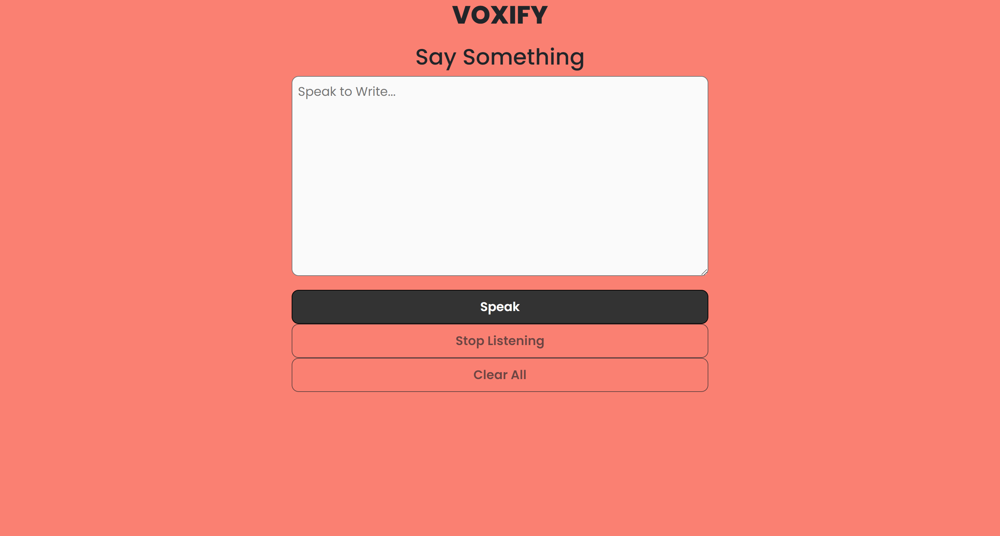
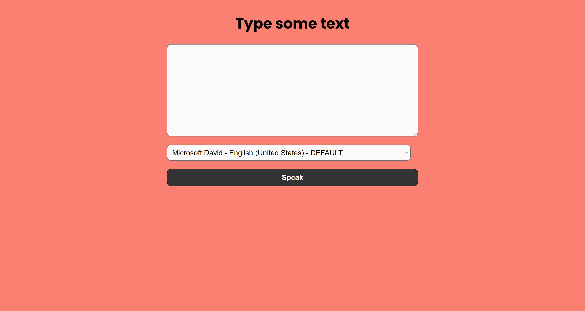

# Voxify: Seamless Text and Speech Integration

Welcome to Voxify, an innovative project where text and speech seamlessly integrate to transform your communication experience. This project is built using JavaScript, HTML, and CSS, providing both Text-to-Speech (TTS) and Speech-to-Text (STT) functionalities to enhance the way you interact with language.

## Getting Started
### Usage
1. Open the `index.html` file in your web browser.
2. Voxify will present you with options to choose between Speech-to-Text (STT) and Text-to-Speech (TTS) functionalities.

#### For Speech-to-Text:

- Speak your thoughts, and Voxify will transcribe them into text in real-time.

#### For Text-to-Speech:

- Enter the text you want to convert into speech.
- Choose voice options for a personalized experience.

### To play the color game:

1. Choose the "Color Game" option in the main menu.
2. Follow the instructions to speak the name of a color.
3. Watch the background magically change to the color you've spoken!

## Example Commands
### Speech-to-Text:

- Speak: "How are you today?"

### Text-to-Speech:

1. Enter text: "Hello, Voxify!"
2. Choose the Voice

## Enjoy Voxify!

Explore the seamless integration of text and speech with Voxify. Elevate your communication experience and have fun with the color game!

## Contributing

Feel free to fork this project and contribute to its development. If you have ideas for improvements or new features, create a pull request. Let's collaborate and build exciting stuff together!
